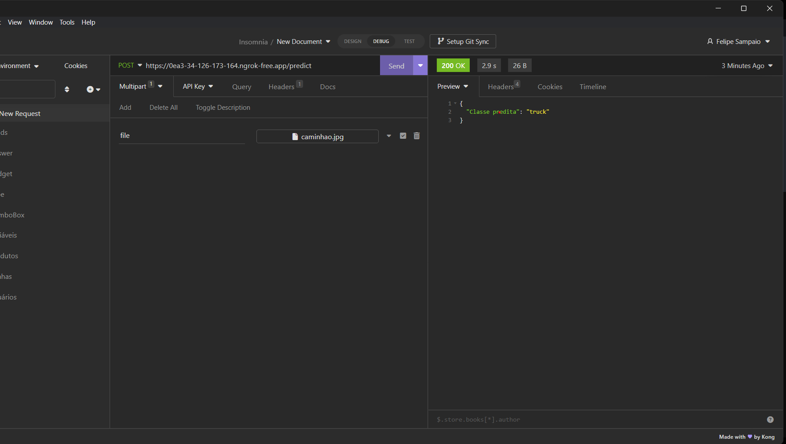

# semana6-atividade-programacao


# Semana 6 - Atividade de Programação

Este projeto envolve a criação e treinamento de um modelo de rede neural convolucional (CNN) para classificação de imagens usando o conjunto de dados CIFAR-10. A implementação foi feita em Python usando TensorFlow e Keras.

## Estrutura do Modelo

```python
import tensorflow as tf
from tensorflow.keras import datasets, layers, models

# Carregando os dados CIFAR-10
(train_images, train_labels), (test_images, test_labels) = datasets.cifar10.load_data()

# Normalizando os valores dos pixels
train_images, test_images = train_images / 255.0, test_images / 255.0

# Definindo a arquitetura do modelo
model = models.Sequential([
    layers.Conv2D(32, (3, 3), activation='relu', input_shape=(32, 32, 3)),
    layers.MaxPooling2D((2, 2)),
    layers.Conv2D(64, (3, 3), activation='relu'),
    layers.MaxPooling2D((2, 2)),
    layers.Conv2D(128, (3, 3), activation='relu'),
    layers.MaxPooling2D((2, 2)),
    layers.Flatten(),
    layers.Dense(128, activation='relu'),
    layers.Dropout(0.5),
    layers.Dense(10)
])

# Compilando o modelo
model.compile(optimizer='adam',
              loss=tf.keras.losses.SparseCategoricalCrossentropy(from_logits=True),
              metrics=['accuracy'])

# Treinando o modelo
model.fit(train_images, train_labels, epochs=5,
          validation_data=(test_images, test_labels))

# Salvando o modelo treinado
model.save('cifar10_cnn_model.h5')

```

A ideia foi disponibilizar o modelo via API, para isso utilizei o Insomnia para teste, utilizei algumas imagens para ver como o modelo respondia:

## Testes na API

A ideia foi passar na requisição através da seguinte URL. Que no caso, é a URL pública disponibilizada pelo ngrok acompanhada pelo ```/predict```.

 ```https://0ea3-34-126-173-164.ngrok-free.app/predict```

### Imagens Originais e Resultados dos Testes

### Caminhão




### Sapo


### Cavalo


